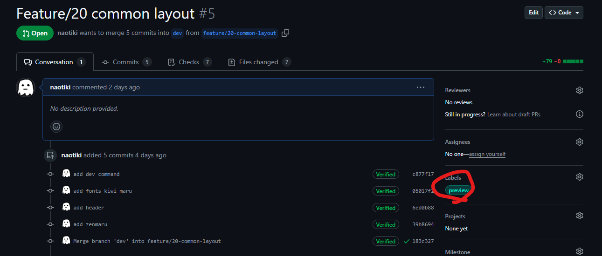
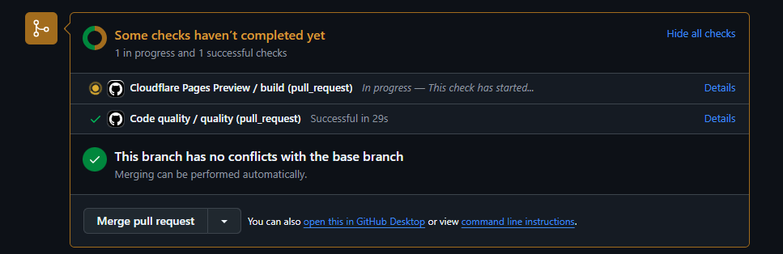
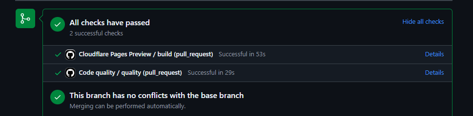
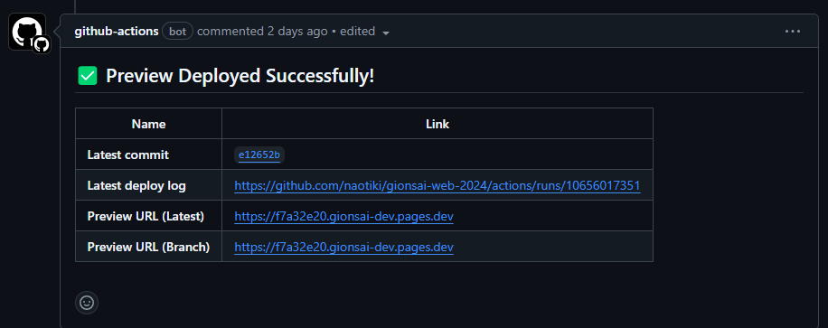

# remix (フロントエンド)
## scripts
### 開発環境の起動
```sh
pnpm dev
```
### ビルド
```sh
pnpm build
```

## 使用している技術
- [React](https://reactjs.org/)
- [Remix](https://remix.run/)
- [TypeScript](https://www.typescriptlang.org/)
- [TailwindCSS](https://tailwindcss.com/)
- [shadcn/ui](https://ui.shadcn.com/)
  - 詳細は [shadcn.md](./shadcn.md) を参照
- [Vite](https://vitejs.dev/)
- [pnpm](https://pnpm.io/)
- ...

## 基本ファイル構成
一部省略
```sh
apps/remix/
├── app/ # Remixのコード
│   ├── assets/ # 画像やJSON,YAMLなどの静的ファイル
│   ├── @types/ # daclareなどの型定義 基本こっちには書かない
│   ├── components/ # コンポーネント
│   │   ├── ui/ # shadcn/uiのコンポーネント
│   ├── lib/ # ライブラリ
│   │   ├── repositories/ # リポジトリ(後で詳しく説明)
│   │   ├── types/ # 型定義
│   │   └── utils/ # 汎用的に使えるもの
│   ├── routes/ # ルーティング
│   │   ├── _index.tsx # /で表示されるページ
│   │   ├── example._index.tsx # /exampleで表示されるページ
│   │   └── example.new.tsx # /example/newで表示されるページ
│   ├── global.css # グローバルに適用されるCSS
│   └── root.tsx # Root(すべての親)のコンポーネント
├── .env.example # 環境変数のサンプル
├── .gitignore # 除外されるファイル
├── components.json # shadcn/uiの設定
├── package.json # パッケージ情報
├── postcss.config.js # PostCSSの設定
├── tailwind.config.ts # TailwindCSSの設定
├── tsconfig.json # TypeScriptの設定
└── vite.config.ts # Vite(バンドラー)の設定
```
基本的にみんながいじるのは、app/以下のファイルになると思う。特にroutes/やcomponents/。

app/routes/以下でルーティングを定義する。
つまり、どこにアクセスしたらなにが表示されるのかを定義する。
Remixではファイルの名前によってルーティングが決まる。
| ファイル名 | ルーティング |
| --- | --- |
| _index.tsx | / |
| example._index.tsx | /example |
| example.new.tsx | /example/new |
詳しくは https://zenn.dev/heysya_onsya/articles/5aae742104b32a が参考になる。

## Remixのファイル
```tsx
// 省略

export async function loader() {
  // リポジトリからタスクを取得
  const tasks = await taskRepository.listTask();
  // JSON形式化して返す
  return json({ tasks });
}
export async function action({ request }: ActionFunctionArgs) {
  const formData = await request.formData();
  // 実行するアクション
  const intent = formData.get("_intent") as string;
  // アクションで複数の動作を行いたい場合はswitch文を使って分岐
  switch (intent) {
    case "updateCompleted": {
      const taskId = formData.get("taskId") as string;
      await taskRepository.updateTask(taskId, {
        completed: formData.get("completed") === "true",
      });
      break;
    }
    default:
      throw Error(`invalid intent ${intent}`);
  }
  return null;
}

export default function ToDo() {
  // ローダーで取得したデータを取得
  const { tasks } = useLoaderData<typeof loader>();
  // Form外でアクションを実行するためのフック
  const submit = useSubmit();
  return (
    <>
      <header className="flex p-5">
        <h1 className="text-3xl font-extrabold">To Do App</h1>
      </header>
      <main>
        {/* リンクを使って新規タスク追加ページへ遷移 */}
        <Link to="/example/new" className="ml-5">
          Add Task
        </Link>
      </main>
    </>
  );
}

```
### `async function loader`
サーバー側でデータを取得する。事前にデータなどを取得したいときはここに書く。
### `async function action`
フォームの送信やデータの変更などを行う。サーバー側で行いたい処理はここに書く。
### `default function XXX`
XXXは任意の名前でいい。コンポーネントを返す。ここに書いた内容が表示される。
## リポジトリ(Repository)
言葉の意味としてリポジトリはデータの永続化を行うやつのこと。

Git/GitHubのリポジトリとは異なるので注意。

今回、バックエンドに縛られない開発をするためにリポジトリの概念を導入してみている。

APIと実際に通信するメイン実装と、APIの挙動を模倣するモック実装を分けることで、バックエンドの実装ができる前にフロントエンドの開発を進めることができる。

実装例は以下のファイルから見れる。
- [リポジトリの実装例](/apps/remix/app/lib/repositories/taskRepository.ts)
- [リポジトリの使用例](/apps/remix/app/routes/example._index.tsx)
- [リポジトリの使用例2](/apps/remix/app/routes/example.new.tsx)

詳細は [リポジトリ](./repository.md) を参照

## RPC (Remote Procedure Call)

今回のプロジェクトでは、APIとの通信でRPCという技術を使えるようにしている。RPCを使うとAPIをあたかもただの関数呼び出しのように扱うことができる。

```ts
import { rpc } from "~/lib/utils/hc";
// /api/example/tasksにGETリクエストを送る
const response = await rpc.api.example.tasks.$get();
// 結果を取得
const result = await res.json();
```

型も自動で生成されるので、型安全にAPIを叩くことができる。

## 自動プレビュー生成
`/apps/remix`以下を更新したPRにおいて、`preview`ラベルを付与すると、GitHub Actionsが走り、自動でプレビューを生成し、URLを投げてくれる。
これによって、レビューがより簡単に行える。
### 注意
* CIでビルドされる際、環境変数`USE_SPA`が`true`になる。
`USE_SPA`が`true`のとき、`mock`関数はモックを選択する。
* Viteによって無理やりコードを書き換えているため、正常に動作しないことがある。

### 1. `preview`の付与
右側のLabelsをクリックし`preview`を追加する

### 2. Actionの終了を待つ
`preview`を付与したあと、自動でActionが走る。

成功すると以下のようにチェックマークがつく。

### 3. URLが投げられる
生成されたページのURLがPRのコメントで投げられる。
